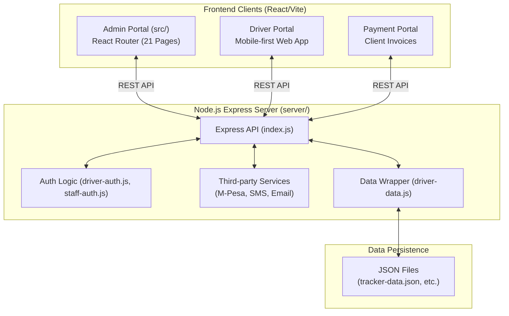

# Segecha Internal Tracker — System Architecture Documentation

## 1. Executive Summary
The Segecha Internal Tracker is a comprehensive **truck fleet management ERP** built for **Segecha Group Ltd** (Nairobi, Kenya). The system manages trucks, drivers, journeys, fuel consumption, expenses, invoices, payroll, tyre health, and financial P&L reporting. 

The application has evolved from a monolithic React frontend into a robust multi-portal architecture comprising a central **Admin Tracker** portal, a dedicated **Driver Portal**, a **Payment Portal** for clients, and a **Node.js Express Backend** that orchestrates communications, authentication, standard APIs (M-Pesa, SMS, Email), and JSON-based data persistence.

---

## 2. Technology Stack

| Layer | Technology | Notes |
|-------|-----------|--------|
| **Admin Portal** | React 19, Vite, React Router DOM | Runs on `TRACKER_URL`. Contains 21 distinct routed pages. |
| **Driver Portal** | React, Vite | Mobile-first unified interface for drivers on `DRIVER_PORTAL_URL`. |
| **Payment Portal** | React, Vite | Public invoice payment interface on `PORTAL_URL`. |
| **Backend API** | Node.js, Express | Coordinates auth, integrations, and file I/O operations. |
| **Data Storage** | JSON files | `tracker-data.json`, `staff-auth.json`, `drivers-auth.json` |
| **Integrations** | Africa's Talking, Safaricom Daraja, SendGrid | SMS, M-Pesa STK Push, Email |
| **File Storage** | Cloudinary, AWS S3/R2 | For odometer photos, delivery proofs, and document management. |

---

## 3. Project Structure
```
segecha_internal_tracker/
├── src/                    # Main Admin Portal (React/Vite)
│   ├── components/         # Shared structural UI (Sidebar, Topbar, Modals, etc.)
│   ├── pages/              # 21 distinct views (Dashboard, Fleet, Routes, Drivers, Journeys, etc.)
│   ├── hooks/              # Custom state and hook logic
│   └── utils/              # Env bindings and permissions logic
├── server/                 # Node.js Express Backend
│   ├── index.js            # Main Express application routing and endpoints
│   ├── driver-auth.js      # Driver authentication logic
│   ├── staff-auth.js       # Admin/Staff authentication logic
│   ├── email.js, sms.js, mpesa.js # Third-party integration clients
│   ├── driver-data.js      # Core Data reading/writing wrapper for JSON
│   └── *.json              # Data storage files (e.g. tracker-data.json, documents.json)
├── driver-portal/          # Self-contained React app for drivers out in the field
└── payment-portal/         # Public-facing React app for customer invoice resolution
```

---

## 4. Application Architecture



---

## 5. Data Model
While stored primarily in JSON files on the server (`tracker-data.json`), the app relies on relational logical links coordinated by backend utility functions:

- **Trucks**: Core assets tied to drivers, fuel entries, and expenses.
- **Drivers**: Authenticated users who access the Driver Portal to log sub-entities.
- **Staff/Admins**: Authenticated dashboard users with granular role-based permissions (`profilePermissions`).
- **Journeys**: The primary operational unit linking trucks, drivers, origins, destinations, and billing info.
- **Fuel, Expenses, Maintenance**: Modular operational records, typically submitted by drivers into an `_pendingApproval` state.
- **Invoices & Payroll**: Auto-calculated financial artifacts with dedicated webhook integrations for M-Pesa status updates.
- **Customers**: Billing targets mapped via `customerId` on Journey records.

---

## 6. Module Breakdown

### 6.1 Backend API (Express)
- **Auth Routes**: Full JWT-based login, auto-credential generation, and token-based password reset handling for both `driver` and `staff`.
- **M-Pesa Integrations**: Initiates STK push prompts for outstanding invoices and listens for Safaricom webhooks to automatically mark invoices as paid.
- **Communications**: Sends tailored SendGrid HTML emails (company-branded invoices, welcome/reset links) and Africa's Talking SMS alerts.
- **Validation**: Accepts photo proofs and driver forms, pushing them into a pending queue for admin review via `/api/admin/submission/verify`.

### 6.2 Admin Tracker Pages (`src/pages/`)
- **Dashboard**: High-level KPI aggregates, tyre alerts, and actionable pending verification queues.
- **Fleet & VehicleProfile**: Card-based asset overviews with detailed single-vehicle drill-downs.
- **Drivers & Staff Profiles**: Identity management, base salary adjustments, and tracking of individual platform activity.
- **Journeys & JourneyProfile**: Comprehensive tracking of freight trips and generation of Waybills.
- **Financial Core (FuelLog, Expenses, Invoices, Payroll, PnL)**: The ERP backbone for tracking unit economics, building itemized invoices, and calculating net margins per truck over time.
- **Settings**: Configuration for global app behavior, driver sync logic, and staff role/permission definitions.

### 6.3 Driver Portal
- Mobile-optimized interface operating strictly under `DRIVER_PORTAL_URL`.
- Enforces multi-stage workflows designed for the field:
  - **Start Trip**: Capture odometer numbers + dashboard photo, specify delivery payload. 
  - **End Trip**: Document final odometer reading + snap a photo of the signed delivery waybill.
- Submits Incident reports, toll receipts, and fuel fill-ups cleanly into the Admin review system rather than mutating global data arbitrarily.

### 6.4 Payment Portal
- Minimal public-facing component (`PORTAL_URL`) where external clients input their phone numbers against specific invoice IDs, securely prompting them to complete an M-Pesa transaction without accessing the main platform.

---

## 7. Operational Data Flow
1. **Reads**: Frontends fetch hydrated states from the Express backend via REST routes mapping directly to local entity models.
2. **Mutations**: Clients execute `POST/DELETE` requests against domain-specific controllers.
3. **Approval Lifecycle**: Crucial field inputs (fuel cost, mileage) enter a `_pendingApproval` holding state. Administrators use the `VerificationModal.jsx` component within the dashboard to review evidence images side-by-side with submitted values, accepting or rejecting the changes with attached reasons.
4. **Persistence**: The Node.js application executes synchronous file operations safely to `tracker-data.json`, minimizing races within the basic deployment environment.

---

## 8. Current State Overview & Technical Debt
The critical debt associated with the initial v2.0 prototype (monolithic UI file without routing and volatile state-only memory) has been entirely resolved.

### Recommended Next Infrastructure Iterations:
- **Database Standardization**: Safely transitioning raw JSON file storage into PostgreSQL or MongoDB to ensure atomicity, better indexing, and crash durability under concurrent read/write scaling.
- **Type Safety**: Moving the codebase incrementally to TypeScript, especially in the shared contract API spaces connecting the backend logic to the three disparate frontends.
- **Environment Management**: Hardening cloud secrets (Cloudinary URL structures, SendGrid API keys) away from the development scope for proper localized Docker deployments.

> *Document updated on 2026-03-23 · Architecture version: Multi-Portal Full Stack ERP*
